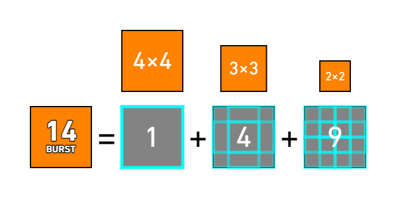
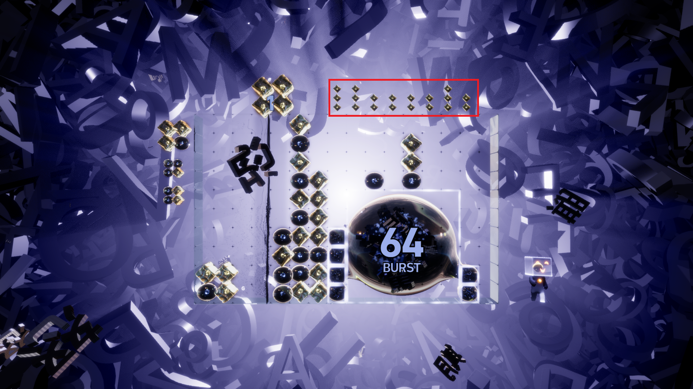

# Lumines Arise Burst mechanics introduction
## Charging
Above the timeline, there's a number representing the charging progress. At 50%, the number changes color, indicating you can enter Burst. At 100%, a powerful audio and visual effect plays, and the number changes to "MAX", indicating you can enter Burst mode with the maximum number of sweep rounds.

Charging progress is proportional to the number of 2x2 squares you've formed (without waiting for the timeline to clear). Once you've formed 70 2x2 squares, it's fully charged.
## Enter Burst, sweep rounds of Burst 
**Notice that: If you hear the level complete SFX in Journey Mode, you won't be able to enter a Burst in that level even if you have enough progress.**

A half Burst has a sweep count of 3, and a full Burst has a sweep count of 5, **shown above the timeline**.

Entering a Burst near the end of a timeline will grant you an extra sweep count to prevent you from missing a sweep round by starting the Burst too late. This margin is approximately 4 columns for a full Burst, and 2 columns for a half Burst.

If you start a Burst approximately halfway through the last column, a full Burst will likely become 7 rounds, effectively resulting in a 6-round Burst. The exact reason for this is unknown.
A half Burst can be played in the same way, which you can get a 4-round Burst, but it's almost impossible.

It seems that a full Burst of 6 or even 7 rounds is more common in Burst Battle.

**You won't die during Burst, but if you topped out, the sweep count will immediately dropped to 1.**
## Burst Color Selection
When entering Burst, the largest match on the board is selected as the **Burst Heap**. In the official tutorial, both the Burst mechanism itself and the huge match created during the Burst are all called "Burst". Here, the **Burst Heap** is used to refer to the latter for easier distinction.

If two identically sized matches of different colors appear, a fixed color is selected.

**Once a Burst color is selected, it won't change throughout the Burst.**
## Burst Count
The Burst count has two parts. One part is **other 2x2 squares that are erased during the Burst and are not part of the Burst Heap**. How many squares are erased, how much value this part is.

The other part, which is the focus of this section, is **how the Burst Heap is counted**.

The game counts **squares of 2×2 or larger** in the Burst Heap, and the total is the Burst Heap count. For example, if the Burst Heap is a 4×4 square, it contains 1 4×4 square, 4 3×3 squares, and 9 2×2 squares, for a total of (1+4+9=14).

The sum of the two parts is the Burst count, which is shown on the largest square of the Burst Heap.

For ease of reference, here are the counts for different sizes of Burst Heaps:
Burst Heap Size|Cells|Burst count
:---:|:---:|:---:
2×2|4|1
3×3|9|5
4×4|16|14
5×5|25|30
6×6|36|55
7×7|49|91
8×8|64|140
9×9|81|204
10×10|100|285
11×10|110|330
12×10|120|375
13×10|130|420
14×10|140|465
15×10|150|510
16×10 (Whole playfield)|160|555

A 16×10 Burst Heap fills the whole field, which means 555 is a "soft cap" of Burst.
## Opposite-color cell Fly up
During Burst, opposite-color cell will fly up when certain conditions are met:
* The largest square in the Burst Heap becomes larger (starting from zero, or existing square when the Burst begins are also count): All surrounding opposite-color cells will **fly up**.
* When the Burst count reaches a certain threshold: A random opposite-color cell surrounding the largest square will fly up. The thresholds are 10, 20, 30, 40, 50, 70, 90, 110, 130, and so on. In other words, the first five random fly-ups require a Burst count increase of 10, and subsequent fly-ups require a Burst count increase of 20.

If a opposite-color cell to fly up is within a 2×2 or larger square, **all cells within that square will fly up**, **but only counted as one cell**.

Flew-up opposite-colored cells are displayed above the corresponding column, but only a maximum of three are displayed.

## The end of Burst
When the sweep count reaches zero, the Burst Heap will be erased. While the Burst Heap is being erased, you can still expand it, but you cannot increase the Burst count by erasing squares not in the Burst Heap.

When the Burst Heap is completely erased, all flew-up cells will fall. **In Journey Mode, squares erased in the next sweep after a Burst ends do not count towards level progress.**
## Scoring
Each Burst count of a half Burst counts as 50 points, and each Burst count of a full Burst counts as 100 points.
## Combo Score Multiplier
A half Burst must reward x8 BONUS after ending, and a full Burst must reward x16 BONUS.

If you are already in a combo before entering a Burst, the BONUS multiplier will be the greater between the BONUS before the Burst, and the Burst BONUS.