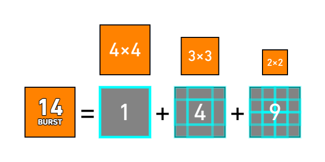
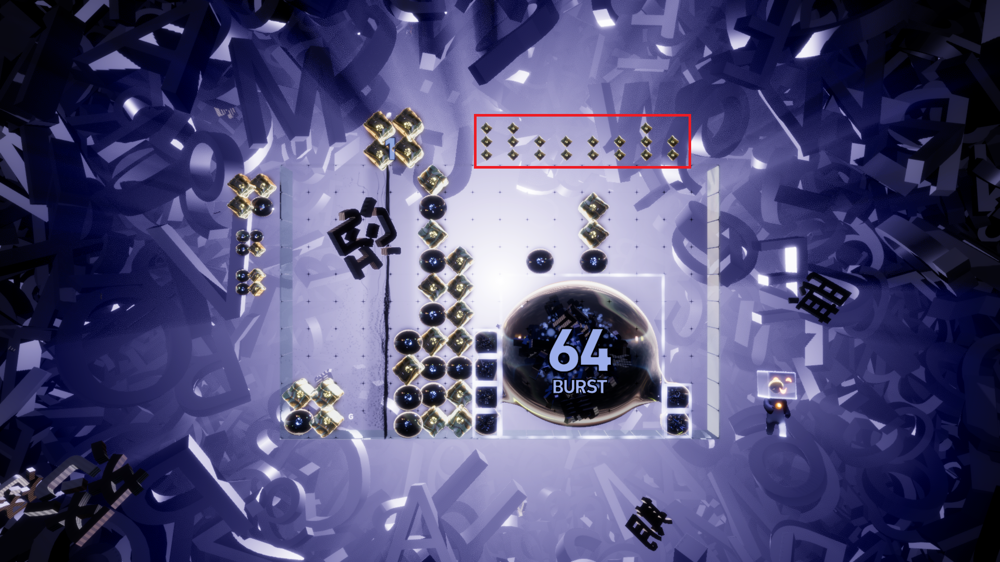

# Lumines Arise Burst 机制详细介绍
## 充能
扫描线（官方称时间线但我更喜欢这么叫）上方有一个数字，这个数字就是**充能进度**。达到 50% 时，数字变色，代表可以进入 Burst；达到 100% 时，有强烈音画特效且数字变成“MAX”，代表可以以最大扫描轮数进入 Burst。

充能进度和拼成的 2×2 正方形数量（无需等待扫描线抹除）呈正比。拼出 70 个 2×2 正方形即是充满状态。
## 进入 Burst、Burst 扫描轮数
**注意：旅程模式中如果听到了关卡通关的音效，即使能量足够也无法在本关进入 Burst。**

半 Burst 的扫描轮数为 3，满 Burst 为 5，**显示于扫描线上方**。

在扫描线快要扫完一轮时进入 Burst，则游戏会额外给予 1 扫描轮数，避免过晚开 Burst 导致的 Burst 轮数少 1 的情况。在满 Burst 的时候这个容错大约是 4 格，半 Burst 则是 2 格。

如果在大概最后一格过完一半的位置开 Burst，那么满 Burst 大概率会变成 7 轮，这样实际上会有一个 6 轮的 Burst，具体原因未知。
半 Burst 也可以如法炮制出 4 轮的 Burst，但几乎卡不出来。

似乎在 Burst 对战中更容易卡出 6 轮甚至 7 轮的满 Burst。
## Burst 颜色选择
进入 Burst 时，会选择场上最大的整块匹配作为 **Burst 堆**。官方教程中，Burst 机制本身和 Burst 期间构造的整块的匹配都叫做 Burst，这里用 **Burst 堆**指代后者，以便区分。

如果有两个相同大小的异色匹配，则会固定选择一个颜色。

**一旦 Burst 的颜色被选定，整个 Burst 期间就不会改变。**
## Burst 计数
Burst 计数分为两部分，一部分是 **Burst 期间消除的不属于 Burst 堆的其它 2×2 正方形**，消除了多少就算作多少。

另一部分是本章节重点：**Burst 堆的计数方式**。

游戏计算 Burst 堆中含有的 **2×2 及以上尺寸的正方形**，总和即为 Burst 堆的计数。例如，如果 Burst 堆是一个 4×4 的正方形，则其包含 1 个 4×4 正方形， 4 个 3×3 正方形，9 个 2×2 正方形，故总和为（1+4+9=14）。

两部分的总和即为 Burst 计数，显示于 Burst 堆的最大正方形上。

为方便查阅，这里给出不同尺寸的 Burst 堆对应的计数：
Burst 堆尺寸|所含方格数|计数
:---:|:---:|:---:
2×2|4|1
3×3|9|5
4×4|16|14
5×5|25|30
6×6|36|55
7×7|49|91
8×8|64|140
9×9|81|204
10×10|100|285
11×10|110|330
12×10|120|375
13×10|130|420
14×10|140|465
15×10|150|510
16×10（整个场地）|160|555

16×10 的 Burst 堆占满整个场地，所以 555 可以视作 Burst 的“软上限”。
## 异色方格升空
Burst 满足一定条件时会导致方块升空：
* Burst 堆中的最大正方形变得更大（从无到有、进入 Burst 时已有的正方形也算）：此时最大正方形周围的所有异色方格会**全部升空**。如果异色方格处于一个 2×2 或更大的正方形中，则这个正方形中所有方格会**全部升空**，**但只记作一格**。
* Burst 计数到达特定阈值时：会挑选最大正方形周围随机一个异色方格升空。阈值表为 10，20，30，40，50，70，90，110，130，……换句话说，前五次随机升空需要 Burst 计数增加 10，后续的都需要 20。
升空的异色方格会在对应列上方显示，但最多显示三个。

## Burst 结束
扫描轮数归零时，本轮扫描会把 Burst 堆抹除，抹除时仍可以扩大 Burst 堆，但无法通过消除非 Burst 堆正方形增加 Burst 计数。

Burst 堆被完全抹除时，此前升空的异色方格会全部落下。**旅程模式中，Burst 结束后下一轮扫描消除的正方形不计入关卡进度。**
## 得分
半 Burst 每一点 Burst 计数 50 分，满 Burst 每一点 Burst 计数 100 分。
## 连击得分倍率
半 Burst 结束时必有 x8 BUNUS，满 Burst 结束时必有 x16 BUNUS。

如果进入 Burst 前已经处于连击状态，则得分倍率和 Burst 前的得分倍率取大。